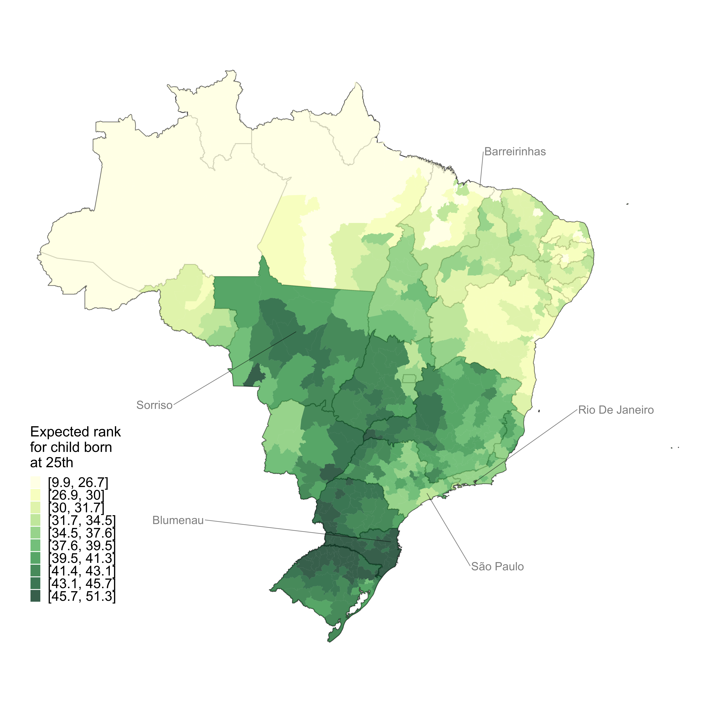

---

##### 下载

+ [PDF](IGM_BFPSW.pdf)

---

##### 媒体报道

+ [VoxEU](https://cepr.org/voxeu/columns/intergenerational-mobility-land-inequality-case-brazil)
+ [Folha de São Paulo](https://www1.folha.uol.com.br/mercado/2022/10/filhos-de-familias-pobres-tem-so-25-de-chance-de-chegar-ao-topo-no-brasil.shtml)
+ [Valor Econômico](https://valor.globo.com/brasil/noticia/2022/10/16/no-brasil-local-de-nascimento-afeta-chance-de-subir-na-vida.ghtml)

---

##### 摘要

我们首次利用一个大型发展中国家（巴西）全国范围的税收数据，估计了代际收入流动性。我们通过税收和工资数据衡量正规收入，并在人口普查和调查数据上训练机器学习模型以预测非正规收入。我们开发了方法来量化和刻画因收入插补及其他测量误差来源所导致的估计偏误，并表明该偏误在我们的研究背景下可忽略不计。父母收入排名每提高10个百分点，子女收入排名平均提高5.5个百分点，且在收入最底层20%家庭出生的子女中，只有2.5%能进入最高20%行列。流动性因性别、种族和地理区域而存在很大差异，因果性的地区效应解释了地区间流动性差异的57%。

---

##### 图：出生于父母收入分布第25百分位的子女成年后平均收入排名

---

##### 引用

Britto et al. 2022. "Intergenerational Mobility in the Land of Inequality." *Working Paper*

---

